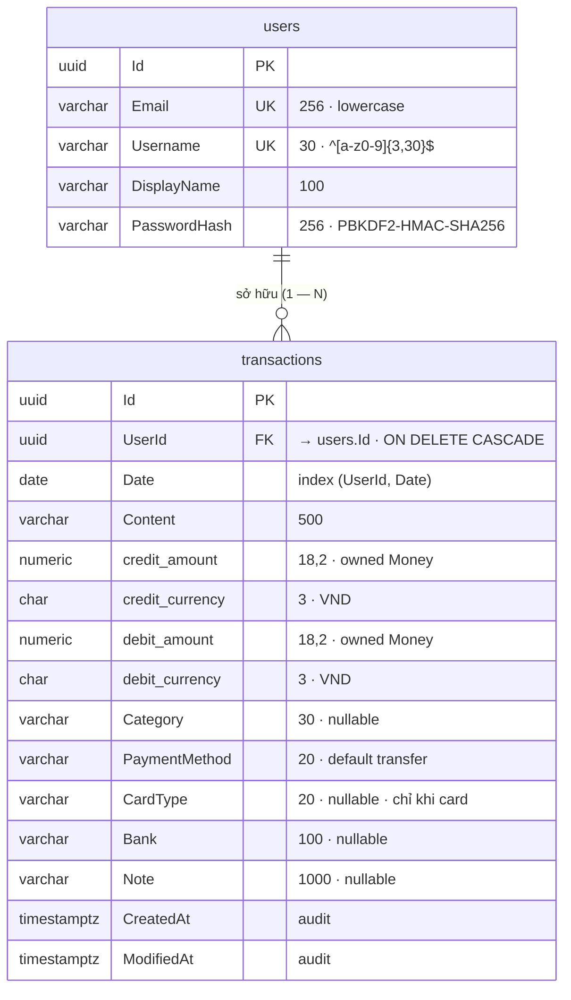

# Database Schema — dmoney

Chụp từ container `dmoney-postgres` (postgres:17-alpine), database `dmoney`, ngày 2026-07-07.

## Danh sách bảng (schema `public`)

| Bảng | Vai trò | Số dòng hiện tại |
|---|---|---|
| `users` | Tài khoản người dùng | 3 |
| `transactions` | Bản ghi thu/chi | 1 |
| `__EFMigrationsHistory` | EF Core theo dõi migration đã áp | 4 |

> Số dòng là ảnh chụp ngày 2026-07-07; cấu trúc bảng bên dưới lấy từ EF Core model
> snapshot (`ApplicationDbContextModelSnapshot.cs`) nên luôn phản ánh schema hiện tại.

## Sơ đồ quan hệ (ER)



`Money` là owned value object (nhúng vào bảng, không có bảng riêng): mỗi giao dịch
có `Credit` (tiền vào) và `Debit` (tiền ra) → 4 cột `*_amount` / `*_currency`.

## `users`

| Cột | Kiểu | Null | Ghi chú |
|---|---|---|---|
| `Id` | uuid | not null | PK |
| `Email` | varchar(256) | not null | unique (`IX_users_Email`) |
| `Username` | varchar(30) | not null | unique (`IX_users_Username`) |
| `DisplayName` | varchar(100) | not null | |
| `PasswordHash` | varchar(256) | not null | PBKDF2-HMAC-SHA256 |

Được tham chiếu bởi: `transactions.UserId` (FK, `ON DELETE CASCADE`).

## `transactions`

| Cột | Kiểu | Null | Ghi chú |
|---|---|---|---|
| `Id` | uuid | not null | PK |
| `UserId` | uuid | not null | FK → `users(Id)`, cascade delete |
| `Date` | date | not null | ngày giao dịch |
| `Content` | varchar(500) | not null | nội dung |
| `credit_amount` | numeric(18,2) | not null | số tiền ghi có (owned type `Money`) |
| `credit_currency` | char(3) | not null | v1: luôn `VND` |
| `debit_amount` | numeric(18,2) | not null | số tiền ghi nợ (owned type `Money`) |
| `debit_currency` | char(3) | not null | v1: luôn `VND` |
| `Note` | varchar(1000) | null | ghi chú |
| `CreatedAt` | timestamptz | not null | AuditingInterceptor |
| `ModifiedAt` | timestamptz | not null | AuditingInterceptor |
| `Category` | varchar(30) | null | 1 trong 7 mã cố định hoặc null (phase 2) |
| `PaymentMethod` | varchar(20) | not null | default `'transfer'`; mã: `transfer`, `cash`, `card` |
| `CardType` | varchar(20) | null | chỉ khi `PaymentMethod = 'card'`; mã: `visa`, `credit` |
| `Bank` | varchar(100) | null | tên ngân hàng tự do (tối đa 100 ký tự) |

Index: `IX_transactions_UserId_Date` btree (`UserId`, `Date`) — phục vụ query theo tháng.

## `__EFMigrationsHistory`

| Cột | Kiểu |
|---|---|
| `MigrationId` | varchar(150) — PK |
| `ProductVersion` | varchar(32) |

Migration đã áp (4):

1. `20260706063550_Initial` — bảng `users`
2. `20260706071722_Transactions` — bảng `transactions`
3. `20260707035144_TransactionCategory` — cột `Category`
4. `20260707145243_AddPaymentMethod` — cột `PaymentMethod`, `CardType`, `Bank`

## Lệnh tự kiểm tra

```bash
docker exec dmoney-postgres psql -U postgres -d dmoney -c '\dt'
docker exec dmoney-postgres psql -U postgres -d dmoney -c '\d users'
docker exec dmoney-postgres psql -U postgres -d dmoney -c '\d transactions'
```
